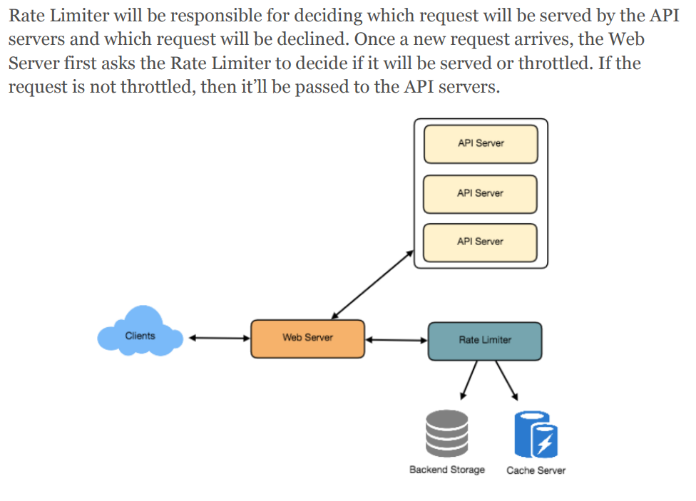

## Designing an API Rate Limiter

- #### Why do we need API rate limiting?
  - prevent attack（Denial-of-service (DOS)attacks, brute-force password attempts, brute-force credit card transactions）
  - Rate limiting is also used to prevent revenue loss
    - Misbehaving clients/scripts
    - Security
    - To prevent abusive behavior and bad design practices
    - To keep costs and resource usage under control
    - Revenue
    - To eliminate spikiness in traffic
- ####  Functional Requirements:
  - Limit the number of requests an entity can send to an API within a time window
  - The APIs are accessible through a cluster, so the rate limit should be considered across different servers.The user should get an error message whenever the defined threshold is crossed within a single server or across a combination of servers.
- #### Non-Functional Requirements
  - The system should be highly available. 
  - Our rate limiter should not introduce substantial latencies affecting the user experience
- #### How to do Rate Limiting?
  - Throttling  **429 - Too many requests**
- #### What are different types of throttling?
  - Hard Throttling: The number of API requests cannot exceed the throttle limit.
  - Soft Throttling: In this type, we can set the API request limit to exceed a certain percentage.
  - Elastic or Dynamic Throttling -> we can let the user send more than 100 messages a minute when there are free resources available in the system
- #### What are different types of algorithms used for Rate Limiting
  - Fixed Window Algorithm
  - Rolling Window Algorithm
- #### High level design for Rate Limiter
  - 
- #### Basic System
  - Fixed Window
    - Atomicity
      - If we are using Redis to store our key-value, one solution to resolve the atomicity problem is to use Redis lock for the duration of the read-update operation. 
      - If we are using a simple hash-table, we can have a custom implementation for ‘locking’ each record to solve our atomicity problems. 
    - Practically, we can assume we would use a Redis or Memcached kind of a solution in a distributed setup. We’ll be storing all the data in the remote Redis servers and all the Rate Limiter servers will read
  - Sliding Window algorithm
    - can store the timestamp of each request in a Redis Sorted Set in our ‘value’ field of hash-table
    - Remove all the timestamps from the Sorted Set that are older than “CurrentTime - 1 minute”.
    - Count the total number of elements in the sorted set. Reject the request if this count is greater than our throttling limit of “3”.
    - Insert the current time in the sorted set and accept the request.
    - 8 + (4 + 20 (sorted set overhead)) * 500 + 20 (hash-table overhead) = 12KB
    - 12KB * 1 million ~= 12GB
    - memory require 12G
    - Here we are reserving 20 bytes overhead per element. In a sorted set, we can assume that we need at least two pointers to maintain order among elements — one pointer to the previous element and one to the next element. On a 64bit machine, each pointer will cost 8 bytes. So we will need 16 bytes for pointers. We added an extra word (4 bytes) for storing other overhead.
  - Sliding Window with Counters
    - where we rate-limit at 500 requests per hour with an additional limit of 10 requests per minute. This means that when the sum of the counters with timestamps in the past hour exceeds the request threshold (500), Kristie has exceeded the rate limit. In addition to that, she can’t send more than ten requests per minute
    - 8 + (4 + 2 + 20 (Redis hash overhead)) * 60 + 20 (hash-table overhead) = 1.6KB
    - 1.6KB * 1 million ~= 1.6GB
- Should we rate limit by IP or by user?
  - IP? Share IP, too much IP, like IP6
  - User: Rate limiting can be done on APIs after user authentication. Once authenticated, the user will be provided with a token which the user will pass with each request. 

