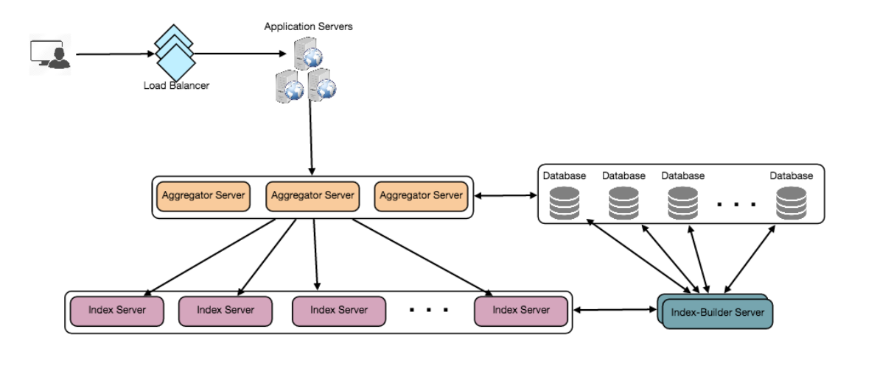

## Designing Twitter Search
- #### Requirements and Goals of the System
    - Let’s assume Twitter has 1.5 billion total users with 800 million daily active users.
    - On average Twitter gets 400 million tweets every day.
    - The average size of a tweet is 300 bytes.
    - Let’s assume there will be 500M searches every day.
    - The search query will consist of multiple words combined with AND/OR
- #### Capacity Estimation and Constraints
  - 400 million new tweets every day and each tweet on average is 300 bytes
  - 400M * 300 Bytes => 120GB/day
- Detailed Component Design
  - Storage: 120GB * 365days * 5years ~= 200TB
  - buffer, backup our total storage requirement will be 500TB.
  - Index?
    - Assyme 500k works, and 5 bytes each word, we will need 500K * 5 => 2.5 MB
    - keyword -》 twitt id; Total 400M * 365 days * 5 years => 730 billion ids
    - how much memory will we need to store all the TweetIDs? 
    - 730B tweets in 5 years, given that each TweetID will be 5 bytes  this will give us 292B tweets in two years 292B * 5 => 1460 GB
    - So our index would be like a big distributed hash table, where ‘key’ would be the word and ‘value’ will be a list of TweetIDs of all those tweets which contain that word.
    - Assume each twite will have 40 words, and only keep useful work, then 15 words
      - TweetID will be stored 15 times in our index
      - (1460 * 15) + 2.5MB ~= 21 TB
      - Assuming a high-end server has 144GB of memory, we would need 152 such servers to hold our index
  - Sharding based on Words?
  - Sharding based on the tweet object? TweetID -> hash
    - 
      - Index-Builder
      - reverse index
  -  Load Balancing
     -   Between Clients and Application servers
     -   Between Application servers and Backend server
         -  Round Robin First
         -  Round Robin LB is it won’t take server load into consideration
         - a more intelligent LB solution can be placed that periodically queries the backend server about their load and adjust traffic based on that