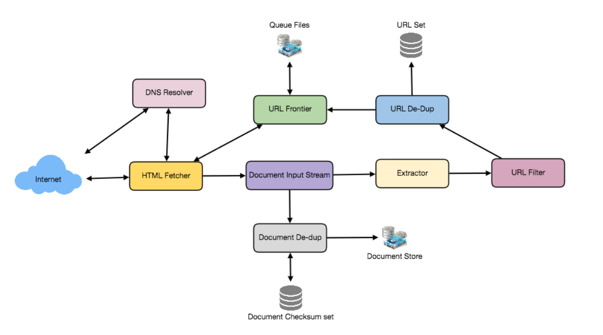

## Designing a Web Crawler
- #### What is a Web Crawler? Why do we need it?
  - search engines build index
  - To test web pages and links for valid syntax and structure.
  - To monitor sites to see when their structure or contents change.
  - To maintain mirror sites for popular Web sites.
  - To search for copyright infringements.
  - To build a special-purpose index, e.g., one that has some understanding of the content stored in multimedia files on the Web
- ####  Requirements
  - Scalability: Our service needs to be scalable such that it can crawl the entire Web and can be used to fetch hundreds of millions of Web documents.
  - Extensibility: Our service should be designed in a modular way with the expectation that new functionality will be added to it. There could be newer document types that needs to be downloaded and processed in the future.

- #### questions before going any further
  - Is it a crawler for HTML pages only? Or should we fetch and store other types of media, such as sound files, images, videos, etc.? Let’s assume for now that our crawler is going to deal with HTML only
  - Let’s assume for now that our crawler is going to deal with HTML only. , it shouldn’t be hard to extend the design to use FTP and other protocols later
  - What is the expected number of pages we will crawl? How big will the URL database become? Let’s assume we need to crawl one billion websites. , let’s assume an upper bound of 15 billion
  - The Robots Exclusion Protocol requires a Web crawler to fetch a special document called robot.txt which contains these declarations from a Web site before downloading any real content from it.
- #### Capacity Estimation
  - 15 billion pages within four weeks 15B / (4 weeks * 7 days * 86400 sec) ~= 6200 pages/sec
  - storage:  an average page size of 100KB; 15B * (100KB + 500) ~= 1.5 petabytes 500 byte is metadata
  - 15B * (100KB + 500) ~= 1.5 petabytes
  - 1.5 petabytes / 0.7 ~= 2.14 petabytes a day
- How to crawl?
  1. Pick a URL from the unvisited URL list.
  2. Determine the IP Address of its host-name.
  3. Establish a connection to the host to download the corresponding document.
  4. Parse the document contents to look for new URLs.
  5. Add the new URLs to the list of unvisited URLs.
  6. Process the downloaded document, e.g., store it or index its contents, etc.
  7. Go back to step 1
- A bare minimum crawler needs at least these components
  - URL frontier
  - HTTP Fetcher
  - Extractor
  - Duplicate Eliminator
  - Datastore
  - 
- How big will our URL frontier be? The size would be in the hundreds of millions of URLs. Hence, we need to store our URLs on a disk. We can implement our queues in such a way that they have separate buffers for enqueuing and dequeuing. Enqueue buffer, once filled, will be dumped to the disk, whereas dequeue buffer will keep a cache of URLs that need to be visited; it can periodically read from disk to fill the buffer.
- Document Dedupe test
  - different URL will have same documents
  - We can use MD5 or SHA to calculate these checksums.
  - How big would be the checksum store? 15B * 8 bytes => 120 GB
- URL filters
  - filter by domain, prefix, or protocol type. We dont need them, like by law
- Domain name resolution: Before contacting a Web server, a Web crawler must use the Domain Name Service (DNS) to map the Web server’s hostname into an IP address. DNS name resolution will be a big bottleneck of our crawlers given the amount of URLs we will be working with. To avoid repeated requests, we can start caching DNS results by building our local DNS server.
- URL dedupe test
  - To save space, we do not store the textual representation of each URL in the URL set, but rather a fixed-sized checksum.
  - How much storage we would need for URL’s store?
  - 15B * 4 bytes => 60 GB; we only need to store checksum
- Can we use bloom filters for deduping? 
  - yes, maybe, but this has false positive problem
- Checkpointing: A crawl of the entire Web takes weeks to complete.
- Data Partitioning
  - URLs to visit
  - URL checksums for dedupe
  - Document checksums for dedupe.

When we do dedpue, we only need to do it on checksum; but when we store, we need to stoer the actual document and urls