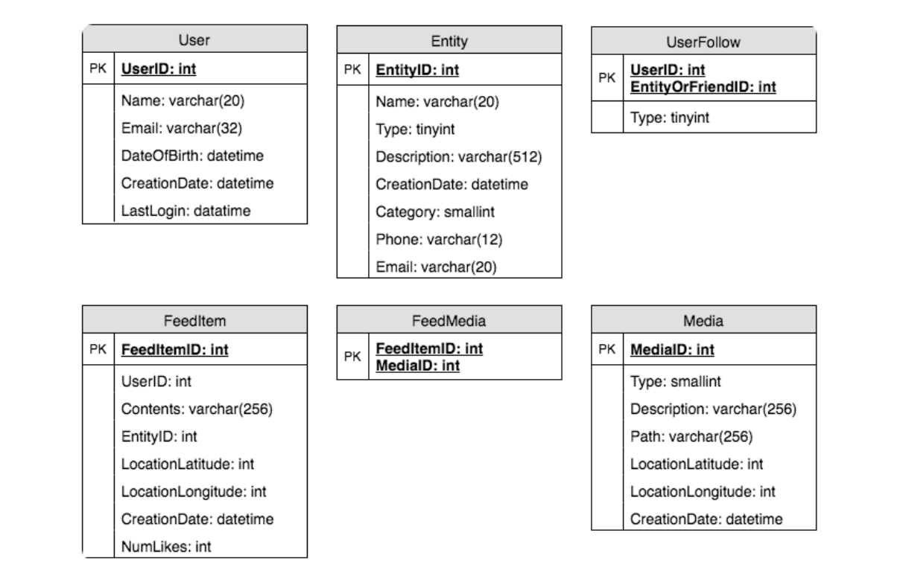
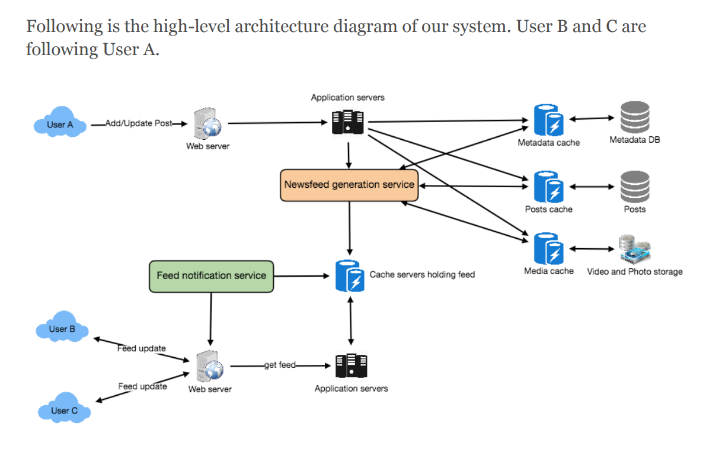

## Designing Facebook’s Newsfeed
- #### Requirements and Goals of the System
  - Functional requirements
    - Newsfeed will be generated based on the posts from the people, pages, and groups that a user follows
    - A user may have many friends and follow a large number of pages/groups.
    - Feeds may contain images, videos, or just text.
    - Our service should support appending new posts as they arrive to the newsfeed for all active users
  - Non-functional requirements
    - Our system should be able to generate any user’s newsfeed in real-time -maximum latency seen by the end user would be 2s.
    - A post shouldn’t take more than 5s to make it to a user’s feed assuming a new newsfeed request comes in.
- #### Capacity
  - assume on average a user has 300 friends and follows 200 pages
  - 300M daily active users with each user fetching their timeline an average of five times a day
  - 1.5B newsfeed requests per day or approximately 17,500 requests per second
  - Storage estimates
  - let’s assume we need to have around 500 posts in every user’s feed that we want to keep in memory for a quick fetch
  - 1KB each -> 500KB of data per user
  - To store all this data for all the active users we would need 150TB of memory. If a server can hold 100GB we would need around 1500 machines to keep the top 500 posts in memory for all active users
- ####  Database Design
  - User, Entity(group or page); FeedItem; mainly user -> item and what is inside the feeditem
  - 
- #### High Level System Design
  - Feed generation
    1. Retrieve IDs of all users and entities that Jane follows.
    2. Retrieve latest, most popular and relevant posts for those IDs. These are the potential posts that we can show in Jane’s newsfeed.
    3. Rank these posts based on the relevance to Jane. This represents Jane’s current feed.
    4. Store this feed in the cache and return top posts (say 20) to be rendered on Jane’s feed.
    5. On the front-end, when Jane reaches the end of her current feed, she can fetch the next 20 posts from the server and so on.
  - One thing to notice here is that we generated the feed once and stored it in the cache. 
  - Feed publishing
  - 
-  Detailed Component Design
   -  Feed generation
      -  get all everytime; Very slow; especially for users who follow a lot or has a lot being followed
      -  each update, all follower will refresh all, slow
   -  Offline generation for newsfeed
      -  like a streaming table, snapshot + cdc
      -  We can have dedicated servers that are continuously generating users’ newsfeed and storing them in memory
      -  Whenever these servers need to generate the feed for a user, they will first query to see what was the last time the feed was generated for that user. Then, new feed data would be generated from that time onwards. We can store this data in a hash table where the “key” would be UserID and “value” would be a STRUCT like this:
      -  
   -  How many feed items should we store in memory for a user’s feed?
      -  200 -500 
   -  Should we generate (and keep in memory) newsfeeds for all users?
      -  a more straightforward approach could be, to use a LRU based cache that can remove users from memory that haven’t accessed their newsfeed for a long time
      -   a smarter solution can figure out the login pattern of users to pre-generate their newsfeed, e.g., at what time of the day a user is active and which days of the week does a user access their newsfeed? etc
  -   Feed publishing
      -   The process of pushing a post to all the followers is called a fanout
      -   By analogy, the push approach is called fanout-on-write, while the pull approach is called fanout-on-load.
      -   “Pull” model or Fan-out-on-load
          -   New feed appear slow
          -   most of the time no new feed
      -   “Push” model or Fan-out-on-write
          -   using long poll
          -   problem is, if we have too many folloers, we may have a lot ot push
      -   Hybrid
      -   Specifically, we can stop pushing posts from users with a high number of followers  and only push data for those users who have a few hundred followers.
      -   For celebrity users, we can let the followers pull the updates.
      -   How many feed items can we return to the client in each request? 20 ?
      -   Should we always notify users if there are new posts available for their newsfeed?
      -   However, on mobile devices, where data usage is relatively expensive, it can consume unnecessary bandwidth. Hence, at least for mobile devices, we can choose not to push data, instead, let users “Pull to Refresh” to get new posts.
  -   Feed Ranking
      -   This could be another topic
      -   metric:  user stickiness, retention, ads revenue, etc.
- Data Partitioning
  -  Sharding posts and metadata
  -  Sharding feed data
     -  For feed data, which is being stored in memory, we can partition it based on UserID
     -  UserID -> feed object from the feed server