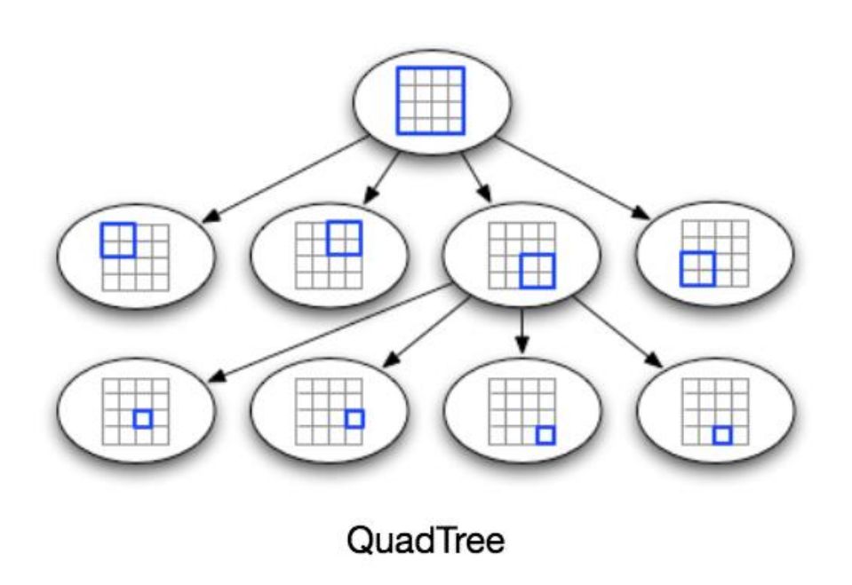
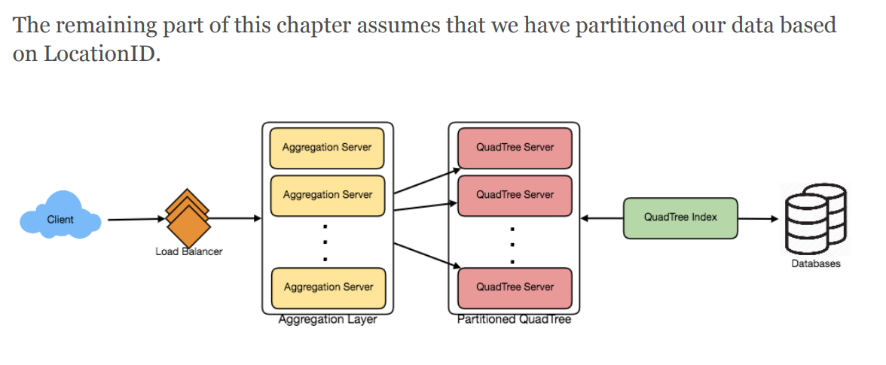

## Designing Yelp or Nearby Friends

- #### Requirements and Goals of the System
  - **What do we wish to achieve from a Yelp like service?** Our service will be storing information about different places so that users can perform a search on them. Upon querying, our service will return a list of places around the user.
  - **Functional Requirements**
    - Users should be able to add/delete/update Places.
    - Given their location (longitude/latitude), users should be able to find all nearby places within a given radius
    - Users should be able to add feedback/review about a place. The feedback can have pictures, text, and a rating.
  - **Non-functional Requirements**:
    - Users should have a real-time search experience with minimum latency
    - Our service should support a heavy search load. There will be a lot of search requests compared to adding a new place
- Scale Estimation
  - we have 500M places and 100K queries per second (QPS).
  - assume a 20% growth in the number of places and QPS each year.
- Database Schema: 500M locations
  1. LocationID (8 bytes): Uniquely identifies a location.
  2. Name (256 bytes)
  3. Latitude (8 bytes)
  4. Longitude (8 bytes)
  5. Description (512 bytes)
  6. Category (1 byte): E.g., coffee shop, restaurant, theater, etc.
    -Photo, rating and review:
        1. LocationID (8 bytes)
        2. ReviewID (4 bytes): Uniquely identifies a review, assuming any location will not have more than 2^32 reviews.
        3. ReviewText (512 bytes)
        4. Rating (1 byte): how many stars a place gets out of ten.
        5. Similarly, we can have a separate table to store photos for Places and Reviews.

- Basic System Design and Algorithm
  - Given that the location of a place doesn’t change that often, we don’t need to worry about frequent updates of the data. As a contrast, if we intend to build a service where objects do change their location frequently, e.g., people or taxis, then we might come up with a very different design.
  - SQL solution
  - Grids
    - We can divide the whole map into smaller grids to group locations into smaller sets.
    - Should we keep our index in memory? ‘key’ is the grid number and ‘value’ is the list of places contained in that grid.
    - (4 * 20M) + (8 * 500M) ~= 4 GB to store index; LocationID is 8 bytes; four bytes number to uniquely identify each grid
  - Dynamic size grids
    - how to map these grids to locations
    - how to find all the neighboring grids of a grid
    - no more than 500 places in a grid, automatically split and merge
    - ny have more grids and pacific Ocean has less
    - What data-structure can hold this information? A tree in which each node has four children can serve our purpose.
    - 
    - Repeatly build, to split
  - How will we find the grid for a given location? ? We will start with the root node and search downward to find our required node/grid.At each step, we will see if the current node we are visiting has children. If it has, we will move to the child node that contains our desired location and repeat this process. If the node does not have any children, then that is our desired node.
  - How will we find neighboring grids of a given grid? through parent nodes.
  - What will be the search workflow? We will first find the node that contains the user’s location. If that node has enough desired places, we can return them to the user. If not, we will keep expanding to the neighboring nodes (either through the parent pointers or doubly linked list) until either we find the required number of places or exhaust our search based on the maximum radius.
  - How much memory will be needed to store the QuadTree?
    - 24 * 500M => 12 GB, cache only LocationID and Lat/Long
    - how many total grids we will have? 500M / 500 => 1M grids
- Data Partitioning
  - Sharding based on regions
    - What if a region becomes hot?
    - Over time, some regions can end up storing a lot of places compared to others
    - repartition our data or use consistent hashing
  - Sharding based on LocationID
    - Our hash function will map each LocationID to a server where we will store that place. While building our QuadTree, we will iterate through all the places and calculate the hash of each LocationID to find a server where it would be stored. To find places near a location, we have to query all servers and each server will return a set of nearby places. A centralized server will aggregate these results to return them to the user.
    - 

- Replication and Fault Tolerance
  -  master-slave configuration
  -  What will happen when a QuadTree server dies? We can have a secondary replica of each server and, if primary dies, it can take control after the failover.
  -  What if both primary and secondary servers die at the same time? We have to allocate a new server and rebuild the same QuadTree on it. This is not very efficient since we need to iterate the whole server; and can not serve while we are rebuild
  -  How can we efficiently retrieve a mapping between Places and QuadTree server? We have to build a **reverse index** that will map all the Places to their QuadTree server. We can have a separate QuadTree Index server that will hold this information
  -  ‘key’ is the QuadTree server number and the ‘value’ is a HashSet containing all the Places being kept on that QuadTree server. We need to store LocationID and Lat/Long with each place because information servers can build their QuadTrees through this.
  -  We should also have a replica of the QuadTree Index server for fault tolerance. 
- Load Balancing
  - Between Clients and Application servers
  - Between Application servers and Backend server

- Ranking?
  - How about if we want to rank the search results not just by proximity but also by popularity or relevance?
    - Let’s assume we keep track of the overall popularity of each place. An aggregated number can represent this popularity in our system
    - We will store this number in the database as well as in the QuadTree.

Remember that we didn’t build our system to update place’s data frequently. With this design, how can we modify the popularity of a place in our QuadTree? Assuming the popularity of a place is not expected to reflect in the system within a few hours, we can decide to update it once or twice a day, especially when the load on the system is minimum.

Yeah, we can expect this popularity will update in batch mode.

Our next problem, Designing Uber backend, discusses dynamic updates of the QuadTree in detail.

