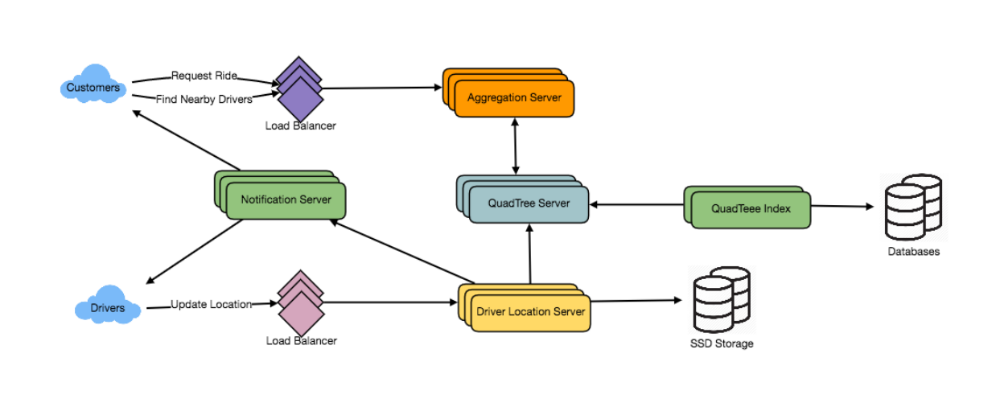

## Designing Uber backend
Let's design a ride-sharing service like Uber, which connects passengers who need a ride with drivers who have a car. 
- Requirements
  - Drivers need to regularly notify the service about their current location and their availability to pick passengers.
  - Passengers get to see all the nearby available drivers.
  - Customer can request a ride; nearby drivers are notified that a customer is ready to be picked up.
  - Once a driver and a customer accept a ride, they can constantly see each other’s current location until the trip finishes.
  - Upon reaching the destination, the driver marks the journey complete to become available for the next ride. 
- Basic System Design and Algorithm
  - we have two issues with our Dynamic Grid solution
    - Since all active drivers are reporting their locations every three seconds, we need to update our data structures to reflect that. -> Update too often
    - We need to have a quick mechanism to propagate the current location of all the nearby drivers to any active customer in that area. Also, when a ride is in progress, our system needs to notify both the driver and passenger about the current location of the car.
  - **Do we need to modify our QuadTree every time a driver reports their location?**
    - So, what if we keep the latest position reported by all drivers in a hash table and update our QuadTree a little less frequently? Let’s assume we guarantee that a driver’s current location will be reflected in the QuadTree within 15 seconds. Meanwhile, we will maintain a hash table that will store the current location reported by drivers; let’s call this DriverLocationHT.
  - How much memory we need for DriverLocationHT?
    - DriverID (3 bytes - 1 million drivers)
    - Old latitude (8 bytes)
    - Old longitude (8 bytes)
    - New latitude (8 bytes)
    - New longitude (8 bytes) Total = 35 bytes
    - 1 million total drivers; 1 million * 35 bytes => 35 MB
  - How much bandwidth will our service consume to receive location updates
    - If we get DriverID and their location, it will be (3+16 => 19 bytes).
    - every three seconds from one million drivers
    - 19MB per three seconds
  - Do we need to distribute DriverLocationHT onto multiple servers? yes, it is better
  - How can we efficiently broadcast the driver’s location to customers?
    - a Push Model
    - We can build our Notification service on a publisher/subscriber model.
  - How much memory will we need to store all these subscriptions?
    -  1M daily active customers and 500K daily active
    -  On average let’s assume that five customers subscribe to one driver.
    -  Assuming we will need 3 bytes for DriverID and 8 bytes for CustomerID,
    -  (500K * 3) + (500K * 5 * 8 ) ~= 21 MB
 -  How can we efficiently implement Notification service? We can either use HTTP long polling or push notifications.
 -  How much bandwidth will we need to broadcast the driver’s location to customers?
    -  5 * 500K => 2.5M subscribe
    -  To all these customers we need to send DriverID (3 bytes) and their location (16 bytes) every second, so, we need the following bandwidth:2.5M * 19 bytes => 47.5 MB/
- How about if clients pull information about nearby drivers from the server? Clients can send their current location, and the server will find all the nearby drivers from the QuadTree to return them to the client. Upon receiving this information, the client can update their screen to reflect current positions of the drivers. Clients can query every five seconds to limit the number of round trips to the server. This solution looks simpler compared to the push model described above.
- Do we need to repartition a grid as soon as it reaches the maximum limit?
  - we can give it a buffer. Let’s say our grids can grow/shrink an extra 10% before we partition/merge them.
- 

How would “Request Ride” use case work?
1. The customer will put a request for a ride.
2. One of the Aggregator servers will take the request and asks QuadTree servers to return nearby drivers.
3. The Aggregator server collects all the results and sorts them by ratings.
4. The Aggregator server will send a notification to the top (say three) drivers simultaneously, whichever driver accepts the request first will be assigned the ride. The other drivers will receive a cancellation request. If none of the three drivers respond, the Aggregator will request a ride from the next three drivers from the list.
5. Once a driver accepts a request, the customer is notified.

Ranking
keep track of the overall ratings of each driver in our database and QuadTree.

Advanced Issues
1. How will we handle clients on slow and disconnecting networks?
2. What if a client gets disconnected when they are a part of a ride? How will we handle billing in such a scenario?
3. How about if clients pull all the information, compared to servers always pushing it?