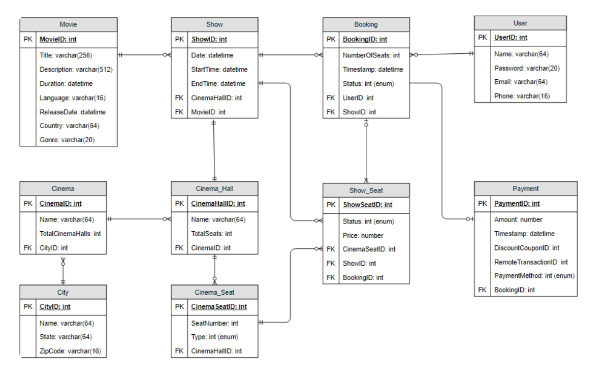
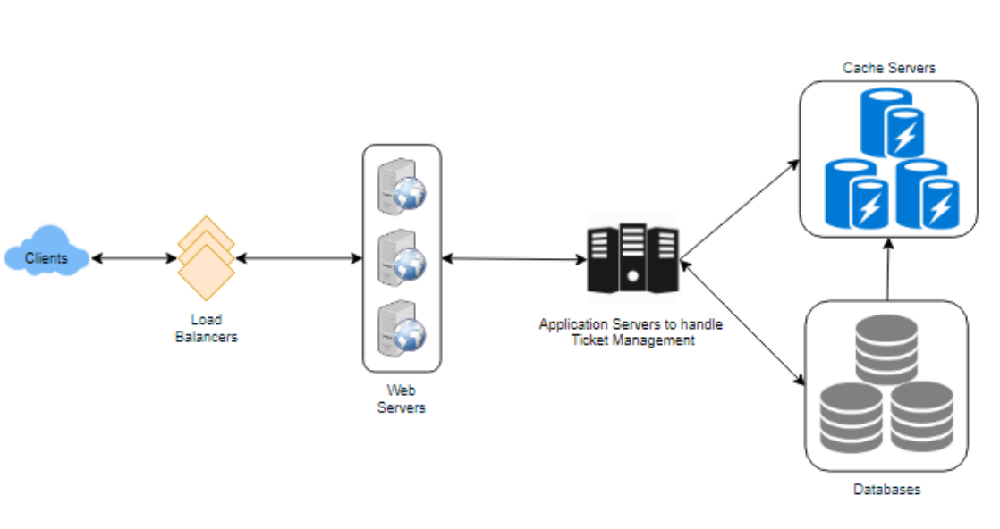

## Design Ticketmaster
online ticketing system that sells movie tickets
#### Functional Requirements:
1. Our ticket booking service should be able to list different cities where its affiliate cinemas are located.
2. Once the user selects the city, the service should display the movies released in that particular city.
3. Once the user selects a movie, the service should display the cinemas running that movie and its available show times.
4. The user should be able to choose a show at a particular cinema and book their tickets.
5. The service should be able to show the user the seating arrangement of the cinema hall. The user should be able to select multiple seats according to their preference.
6. The user should be able to distinguish available seats from booked ones.
7. Users should be able to put a hold on the seats for five minutes before they make a payment to finalize the booking.
8. The user should be able to wait if there is a chance that the seats might become available, e.g., when holds by other users expire.
9. Waiting customers should be serviced in a fair, first come, first serve manner.
#### Non-Functional Requirements:
1. The system would need to be highly concurrent. There will be multiple booking requests for the same seat at any particular point in time. The service should handle this gracefully and fairly.
2. The core thing of the service is ticket booking, which means financial transactions. This means that the system should be secure and the database ACID compliant.
#### Some Design Considerations
1. For simplicity, let’s assume our service does not require any user authentication.
2. The system will not handle partial ticket orders. Either user gets all the tickets they want or they get nothing.
3. Fairness is mandatory for the system.
4. To stop system abuse, we can restrict users from booking more than ten seats at a time.
5. We can assume that traffic would spike on popular/much-awaited movie releases and the seats would fill up pretty fast. The system should be scalable and highly available to keep up with the surge in traffic.

#### Capacity
Traffic estimates：
- 3 billion page views per month
- 10 million tickets a month
Storage estimates：  
- 500 cities；on average each city has ten cinemas. If there are 2000 seats in each cinema and on average 
- each seat booking needs 50 bytes
- 50 bytes e information about movies and cinemas
- 500 cities * 10 cinemas * 2000 seats * 2 shows * (50+50) bytes = 2GB / day

####  Database Design
1. Each City can have multiple Cinemas.
2. Each Cinema will have multiple halls.
3. Each Movie will have many Shows and each Show will have multiple Bookings.
4. A user can have multiple bookings
5. 
#### High Level Design

#### Detailed Component Design
- Once the user selects the seat, the system will try to reserve those selected seats
- If seats can’t be reserved, we have the following options。 couple options
- If seats are reserved successfully, the user has five minutes to pay for the reservation.
- How would the server keep track of all the active reservation that haven’t been booked yet?
  - We need two daemon services, one to keep track of all active reservations and remove any expired reservation from the system
  - ActiveReservationService
    - key:ShowID  
    - value: Linked HashMap containing ‘BookingID’ and creation ‘Timestamp’.
  - WaitingUserService
    - Just like ActiveReservationsService, we can keep all the waiting users of a show in memory in a Linked HashMap or a TreeMap.
    - key:ShowID  
    - value: Linked HashMap 
- Concurrency
  - transactions in SQL databases
  - lock a row
- Fault Tolerance
  - master-slave redis?
  - read from table

Overall, it is a web server connect to a DB. In the middle, we have two service, like `ActiveReservationService` and `WaitingUserService` in memory to serve the queue.