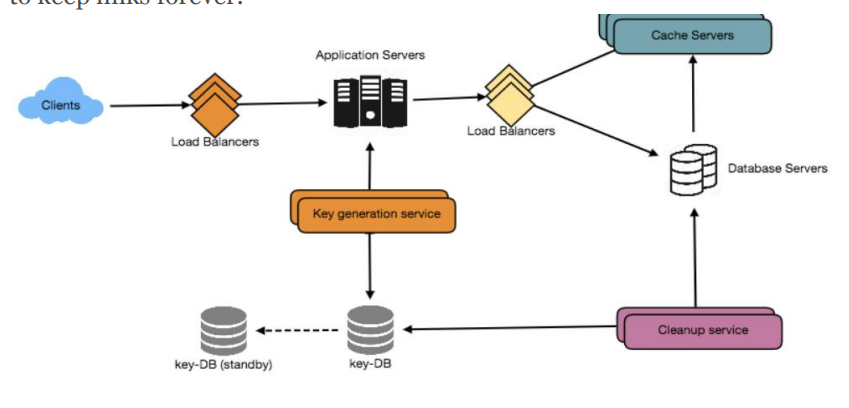

## Designing a URL Shortening service like TinyURL
- #### Requirements and Goals of the System
   - Functional Requirements
      1. Given a URL, our service should generate a shorter and unique alias of it. This 
      is called a short link.
      2. When users access a short link, our service should redirect them to the 
      original link.
      3. Users should optionally be able to pick a custom short link for their URL.
      4. Links will expire after a standard default timespan. Users should be able to 
      specify the expiration time.
   - Non-Functional Requirements:
      1. The system should be highly available. This is required because, if our service is down, all the URL redirections will start failing.
      2. URL redirection should happen in real-time with minimal latency.
      3. Shortened links should not be guessable (not predictable).
- #### Capacity Estimation and Constraints
  - **Write** Traffic estimates: Assuming, we will have 500M new URL shortenings per month
  - **Read** with 100:1 read/write ratio, we can expect 50B redirections during the same period 100 * 500M => 50B messages
  - **Write** QPS: New URLs shortenings per second 500 million / (30 days * 24 hours * 3600 seconds) = ~200 URLs/s
  - **Read** Considering 100:1 read/write ratio, 100 * 200 URLs/s = 20K/s
  - Storage estimates
    - Let’s assume we store every URL shortening request for 5 years.
    - 500 million * 5 years * 12 months = 30 billion
    - Let’s assume that each stored object will be approximately 500 bytes
    - We will need 15TB of total storage, 30 billion * 500 bytes = 15 TB.  500 bytes = 0.5 KB
  - Bandwidth estimates: 
    - total incoming data 200 * 500 bytes = 100 KB/s
    - read requests 20K * 500 bytes = ~10 MB/s
    - 20K requests per second, 1.7 billion requests per day. 20K * 3600 seconds * 24 hours = ~1.7 billion
    - To cache 20% of these requests,we will need 170GB of memory: 0.2 * 1.7 billion * 500 bytes = ~170GB
- High level estimates: Assuming 500 million new URLs per month and 100:1 read:write ratio.
- System APIs
  - api_dev_key (string): The API developer key of a registered account. This will be used to, among other things, throttle users based on their allocated quota.
  - original_url (string): Original URL to be shortened.
  - custom_alias (string): Optional custom key for the URL.
  - user_name (string): Optional user name to be used in encoding.
  - expire_date (string): Optional expiration date for the shortened URL.
  - **Returns**: A successful insertion returns the shortened URL; otherwise, it returns an error code.
- #### Database Design
  - We need to store billions of records.
  - Each object we store is small (less than 1K).
  - There are no relationships between records—other than storing which user created a URL.
  - Our service is read-heavy.
  - Database Schema: 
    - one for storing information about the URL mappings.
    - one for the user’s data who created the short link.
  - Since we anticipate storing billions of rows, and we don’t need to use relationships between objects – a NoSQL key-value store like **DynamoDB, Cassandra or Riak** is a better choice.
- #### Basic System Design and Algorithm
  - MD5 or SHA256 to hash the URL; MD5 -> 128bits
  - Then base64 encoding; -> 6 letters long key can have 64**6 = 68B strings, it is enough
  - MD5 128 bits -> base64 -> 21 characters (since each base64 character encodes 6 bits of the hash value)
  - This may have duplicated issue
    - If multiple users enter the same URL, they can get the same shortened URL, which is not acceptable.
    - What if parts of the URL are URL-encoded?
  - Key Generation Service
    - concurrency? Servers can use KGS to read/mark keys in the database.
    -  two tables to store keys: one for keys that are not used yet, and one for all the used keys.
    -  can always keep some keys in memory
    -  as soon as KGS loads some keys in memory, it can move them to the used keys table.
    -  Maybe we can just use a tag(bool)?
    -  one byte to store one alpha-numeric character
    -  key-DB: 6 (characters per key) * 68.7B (unique keys) = 412 GB.
    -  Isn’t KGS a single point of failure? Yes, it is. To solve this, we can have a standby replica of KGS.
    -  We had a Key-DB to store all keys, then we can have a write lock to prevent two user get same keys, because we will write this key into the database
    -  Should we impose size limits on custom aliases?
- Data Partitioning and Replication
  - Range Based Partitioning
  - Hash-Based Partitioning
- Cache
  - We can cache URLs that are frequently accessed.
  - Memcache
  - How much cache should we have? 20% of daily traffic
  - Which cache eviction policy would best fit our needs?
    - Least Recently Used (LRU)
  - How can each cache replica be updated? Whenever there is a cache miss, our servers would be hitting a backend database.
  - 

- Load Balancer (LB)
  - Between Clients and Application servers
  - Between Application Servers and database servers
  - Between Application Servers and Cache servers
  - Initially, we could use a simple Round Robin approach
    - easy and simple
    - Another benefit of this approach is that if a server is dead, LB will take it out of the rotation and will stop sending any traffic to it
    - A problem with Round Robin LB is that server load is not taken into consideration.
- Purging or DB cleanup
  -  we can slowly remove expired links and do a lazy cleanup. Our service will make sure that only expired links will be deleted, although some expired links can live longer but will never be returned to users.
     -  Whenever a user tries to access an expired link, we can delete the link and return an error to the user.
     -  A separate Cleanup service can run periodically to remove expired links from our storage and cache.
     -  We can have a default expiration time for each link (e.g., two years).
     -  After removing an expired link, we can put the key back in the key-DB to be reused.
     -  
-  Telemetry
   -  Some statistics worth tracking: country of the visitor, date and time of access, web page that refers the click, browser, or platform from where the page was accessed.
- Security and Permissions
  - We can store permission level (public/private) with each URL in the database. 
  - If a user does not have permission and tries to access a URL, we can send an error (HTTP 401) back.
  - The columns will store the UserIDs of those users that have permissions to see the URL

- Summary
  - The Key-DB is only serve as generate key, we will get generated key from it
  - Database Server there is to serve the real input key and output link, use or not uses, and some permission there.
  - We can have two tables in databases; one store used key and another one un used key; if we have only one table there, maybe there is concurrency issue;

