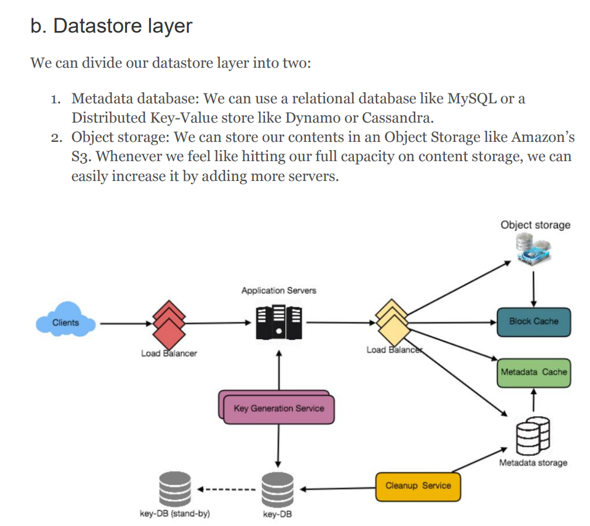

## Designing Pastebin

Users of the service will enter a piece of text and get a randomly generated URL to access it.

- #### What is Pastebin? I think we can clarify the problem first.
  - Such services are also used to share data over the network quickly, as users would just need to pass the URL to let other users see it.

- #### Functional Requirements
  - Users should be able to upload or “paste” their data and get a unique URL to access it
  - Users will only be able to upload text.
  - Data and links will expire after a specific timespan automatically; users should also be able to specify expiration time.
  - Users should optionally be able to pick a custom alias for their paste.
- #### Non-Functional Requirements
  - The system should be highly reliable, any data uploaded should not be lost.
  - The system should be highly available.
  - Users should be able to access their Pastes in real-time with minimum latency.
  - Paste links should not be guessable (not predictable).
- #### Some Design Considerations
  - What should be the limit on the amount of text user can paste at a time?
  - What should be the limit on the amount of text user can paste at a time?
- #### Database Design
  - We need to store billions of records.
  - Each metadata object we are storing would be small (less than 100 bytes).
  - Each paste object we are storing can be of medium size (it can be a few MB).
  - There are no relationships between records, except if we want to store which user created what Paste.
  - Our service is read-heavy.
-  #### High Level Design
   - 
- #### Detailed
  - Since we are generating a random key, there is a possibility that the newly generated key could match an existing one. In that case, we should regenerate a new key and try again
  - Use Key Generation Service
  - Can each app server cache some keys from key-DB? Yes, if server down, the key is wasted. But it is ok, we have enough keys.
  - I think the key point here, we need to haev a lock to read keys.
  - 
