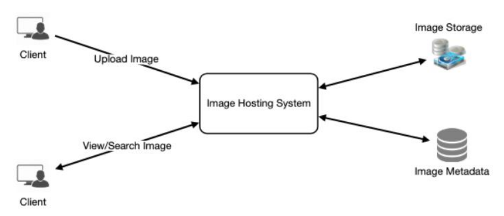
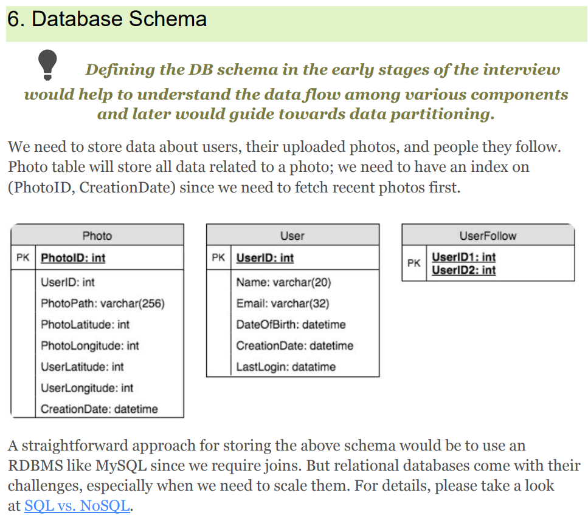
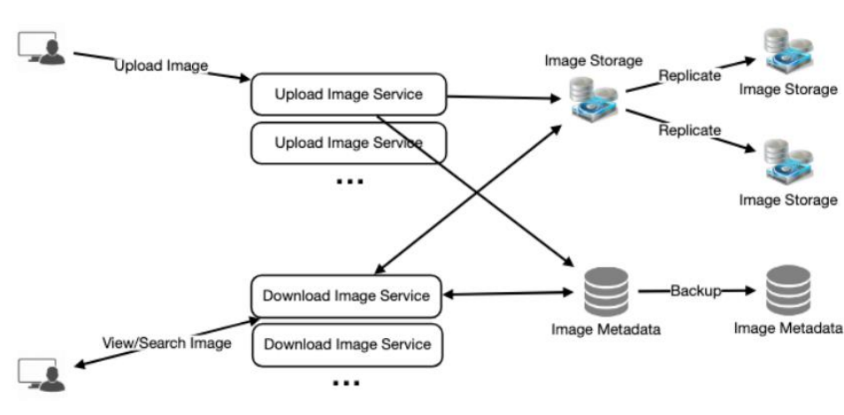

## Designing Instagram
- What is Instagram?
  - For the sake of this exercise, we plan to design a simpler version of Instagram, where a user can share photos and can also follow other users. The ‘News Feed’ for each user will consist of top photos of all the people the user follows.
- Requirements and Goals of the System
  - Functional Requirements
    1. Users should be able to upload/download/view photos.
    2. Users can perform searches based on photo/video titles.
    3. Users can follow other users.
    4. The system should be able to generate and display a user’s News Feed consisting of top photos from all the people the user follows.
    5. Upload; Search; Follow; Feed.
  - Non-functional Requirements
    1. Our service needs to be highly available.
    2. The acceptable latency of the system is 200ms for News Feed generation.
    3. Consistency can take a hit (in the interest of availability), if a user doesn’t see a photo for a while; it should be fine.
    4. The system should be highly reliable; any uploaded photo or video should never be lost.
- Some Design Considerations
  - The system would be read-heavy
  - Practically, users can upload as many photos as they like.
  - Low latency is expected while viewing photos.
  - Data should be 100% reliable. If a user uploads a photo, the system will guarantee that it will never be lost.
  - **Available(Service is high available 24 hrs); Latency(Low); Reliable(upload photo should not be lost)**
- Capacity Estimation and Constraints
  - 500M total users, with 1M daily active users.
  - 2M new photos every day, 23 new photos every second.
  - Average photo file size => 200KB
  - Total space required for 10 years: 400GB * 365 (days a year) * 10 (years) ~= 1425TB
- High Level System Design
  - At a high-level, we need to support two scenarios, one to upload photos and the other to view/search photos
  - 
- Database Schema
  - 
  - **Photo, User, Follow**
  - We can store photos in a distributed file storage like HDFS or S3
  - We can store the above schema in a distributed key-value store to enjoy the benefits offered by NoSQL.
  - We need to store relationships between users and photos, to know who owns which photo. We also need to store the list of people a user follows.
  - For both of these tables, we can use a wide-column datastore like Cassandra.
  - For the ‘UserPhoto’ table, the ‘key’ would be ‘UserID’ and the ‘value’ would be the list of ‘PhotoIDs’ the user owns, stored in different columns. We will have a similar scheme for the ‘UserFollow’ table.
- Component Design
  - we can split reads and writes into separate services
  - Separating photos’ read and write requests will also allow us to scale and optimize each of these operations independently.
-  Reliability and Redundancy
   -  Redundancy removes the single point of failure in the system
   -  
- Data Sharding
  - Partitioning based on UserID
    - issues
    - hot users
    - Some users will have a lot of photos compared to others, thus making a non-uniform distribution of storage.
    - we cannot store all pictures of a user on one shard?If we distribute photos of a user onto multiple shards will it cause higher latencies
    - Storing all photos of a user on one shard can cause issues like unavailability of all of the user’s data if that shard is down or higher latency if it is serving high load etc
  - Partitioning based on PhotoID
    - How can we generate PhotoIDs?
    - One solution could be that we dedicate a separate database instance to generate auto-incrementing IDs. 
    - Wouldn’t this key generating DB be a single point of failure? Yes, it would be.two such databases with one generating even numbered IDs and the other odd numbered.
    - How can we plan for the future growth of our system?multiple logical partitions reside on a single physical database server first, and it would be easy to migrate to more servers.
- Ranking and News Feed Generation
  - 100 photos for a user’s News Feed at run
  - Pre-generating the News Feed - UserNewsFeed table
  - different approaches for sending News Feed contents to the users
    - pull and push
    - Hybrid: We can adopt a hybrid approach. We can move all the users who have a high number of follows to a pull-based model and only push data to those users who have a few hundred (or thousand) follows. Another approach could be that the server pushes updates to all the users not more than a certain frequency, letting users with a lot of follows/updates to regularly pull data
- News Feed Creation with Sharded Data
  - sort photos on their time of creation
  - make photo creation time part of the PhotoID
  - We can use epoch time for this. Let’s say our PhotoID will have two parts; the first part will be representing epoch time and the second part will be an autoincrementing sequence. 
  - So to make a new PhotoID, we can take the current epoch time and append an auto-incrementing ID from our key-generating DB.
  - PhotoID second + sequence, 23 photos per second, we can use 9 bits
- Cache and Load balancing
  - Our service should push its content closer to the user using a large number of geographically distributed photo cache servers and use **CDNs**
  - We can introduce a cache for metadata servers to cache hot database rows.
  - Least Recently Used (LRU) can be a reasonable cache eviction policy for our system
  - How can we build more intelligent cache? If we go with 80-20 rule
    - try caching 20% of daily read volume of photos and metadata