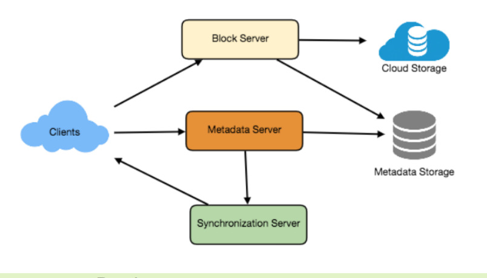
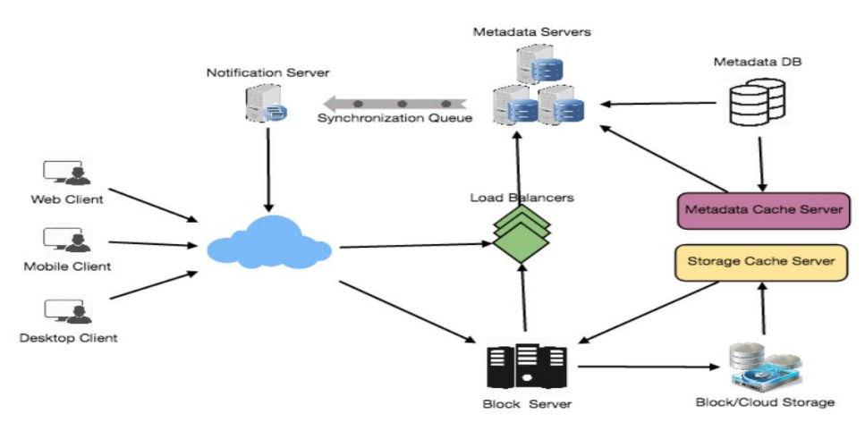

## Designing Dropbox
- Why Cloud Storage?
  - TBH, boring question
  - Availability
  - Reliability and Durability
  - Scalability
- Requirements and Goals of the System
  1. Users should be able to upload and download their files/photos from any device.
  2. Users should be able to share files or folders with other users.
  3. Our service should support automatic synchronization between devices, i.e., after updating a file on one device, it should get synchronized on all devices.
  4. The system should support storing large files up to a GB.
  5. ACID-ity is required. Atomicity, Consistency, Isolation and Durability of all file operations should be guaranteed.
  6. Our system should support offline editing. Users should be able to add/delete/modify files while offline, and as soon as they come online, all their changes should be synced to the remote servers and other online devices.
  7. The system should support snapshotting of the data, so that users can go back to any version of the files.
- Some Design Considerations
  - We should expect huge read and write volumes.
  - Read to write ratio is expected to be nearly the same
- Capacity Estimation and Constraints
  - assume that we have 500M total users, and 100M daily active users
  - Let’s assume that on average each user connects from three different devices
  - On average if a user has 200 files/photos, we will have 100 billion total files.
  - Let’s assume that average file size is 100KB; 100B * 100KB => 10PB
-  High Level Design
   -  metadata
   -  actual data
   -  
-  Component Design
   -  Client
      -  Upload and download files
      -  Detect file changes in the workspace folder.
      -  Handle conflict due to offline or concurrent updates
      -  handle file transfer efficiently
         -  Storage devices
         -  Network bandwidth
         -  Average file size in the storage
      -  keep a copy of metadata with Client
      -  enable us to do offline updates but also saves a lot of round trips to update remote metadata
      -  efficiently listen to changes happening with other clients
         -  HTTP long polling
      -  What we need to client:
         - Internal **Metadata** Database
         - Chunker -> split the files into smaller pieces called chunks
         - Watcher -> Check and sync the change of other device(client)
         - Indexer -> process the events received from the Watcher and update the internal metadata database with information about the chunks of the modified files
       - mobile clients usually sync on demand to save user’s bandwidth and space
    - Metadata Database
      - MySQL, or a NoSQL database service such as DynamoDB
      - NoSQL data stores do not support ACID, but we need that
      - a relational database can simplify the implementation of the Synchronization Service as they natively support ACID properties
      - 1. Chunks; 2. Files; 3. User; 4. Devices; 5. Workspace (sync folders)
    - Synchronization Service
      - The Synchronization Service is the component that processes file updates made by a client and applies these changes to other subscribed clients.
      - only update the changed parts
    - Message Queuing Service
      - Request Queue and Response Queues, to get update and get request status
      - the request should update data and metadata
      - 

-  File Processing Workflow
   -  Client A uploads chunks to cloud storage.
   -  Client A updates metadata and commits changes.
   -  Client A gets confirmation and notifications are sent to Clients B and C about the changes.
   -  Client B and C receive metadata changes and download updated chunks.

- Data Deduplication
  - calculate a hash of it and compare that hash with all the hashes of the existing chunks to see if we already have the same chunk present in our storage
  - two ways in our system
    - Post-process deduplication
      - We will unnecessarily be storing duplicate data, though for a short time;
      - Duplicate data will be transferred
    - In-line deduplication
      - hash calculations
      - only a reference to the existing chunk will be added in the metadata

- Metadata Partitioning
  - Vertical Partitioning:  store all the user related tables in one database and all files/chunks related tables in another database
    - scale issues: too many chucks and files, trillions of chunks
    - Joining two tables in two separate databases can cause performance and consistency issues
  - Range Based Partitioning
    - based on the first letter of file path?
    - unbalanced servers, E more
  - Hash-Based Partitioning
    - hash of the ‘FileID’ of the File object
- Caching
  -  Memcached-> hot files/chunks
  -  Least Recently Used (LRU)
- Load Balancer
  - Between Clients and Block servers
  - Between Clients and Metadata servers
    - Round Robin LB not smart
    - overloaded or slow for one server, we should switch
- Security, Permissions and File Sharing
  - storing the permissions of each file in our metadata DB to reflect what files are visible or modifiable by any user