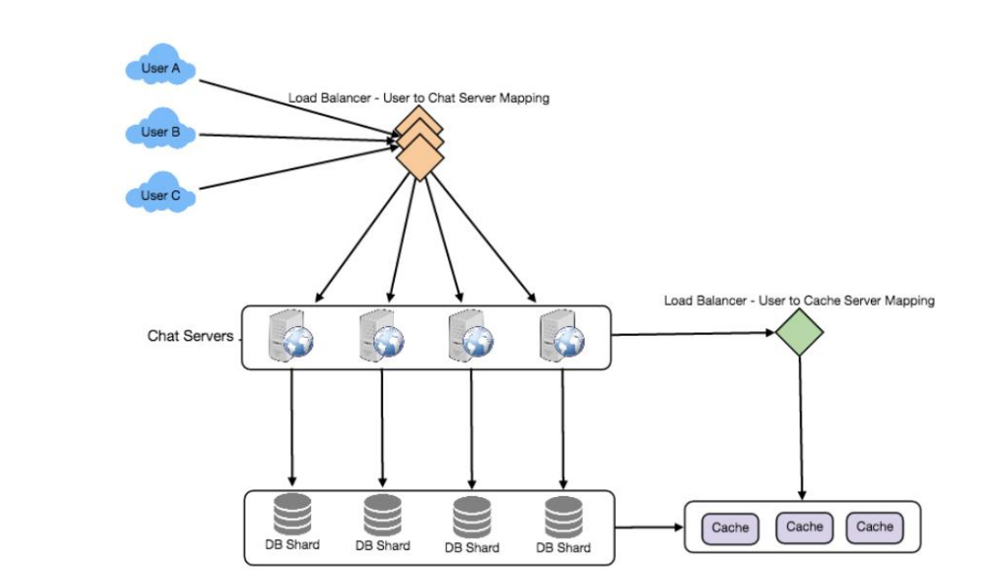

## Designing Facebook Messenger
- Requirements and Goals of the System
  - Functional Requirements
    - Messenger should support one-on-one conversations between users
    - Messenger should keep track of the online/offline statuses of its users.
    - Messenger should support persistent storage of chat history
      - **chat, status, history**
  - Non-functional Requirements:
    - real-time chat experience with minimum latency
    - highly consistent, all device should be the same
    - high availability
      - **available; consistency; latency**
  - Extended Requirements
    - Group Chats
    - Push notifications: Messenger should be able to notify users of new messages when they are offline.
  - High Level Design
    - User-A sends a message to User-B through the chat server.
    - The server receives the message and sends an acknowledgment to User-A.
    - The server **stores the message in its database** and sends the message to User B
    - User-B receives the message and sends the acknowledgment to the server.
    - The server notifies User-A that the message has been delivered successfully to User-B.
- Detailed Component Design
  - Receive incoming messages and deliver outgoing messages
  - Store and retrieve messages from the database
  - Keep a record of which user is online or has gone offline, and notify all the relevant users about these status changes.
  - Messages Handling
    - Pull model
    - Push model
      - 2nd one is preferred
    - How will clients maintain an open connection with the server?
      - **Long Polling or WebSockets**
    - keep track of all the opened connection to redirect messages to the users efficiently? **hash table**
    -  server receives a message for a user who has gone offline？
       -  retry sending the message？ embedded in the client’s logic
       -  server can also store the message for a while and retry sending it once the receiver reconnects
       -  How many chat servers we need？500 million connections at any time; 50K concurrent connections for a server; 10K such servers
    -  How should the server process a ‘deliver message’ request?
       -   Store the message in the database
       -   Send the message to the receiver
       -   Send an acknowledgment to the sender
       -   The chat server will first find the server that holds the connection for the receiver and pass the message to that server to send it to the receiver. The chat server can then send the acknowledgment to the sender; we don’t need to wait for storing the message in the database
 -  Storing and retrieving the messages from the database
    - Start a separate thread, which will work with the database to store the message
    - Send an asynchronous request to the database to store the message.
    - Which storage system we should use?
      - We cannot use RDBMS like MySQL or NoSQL like MongoDB because we cannot afford to read/write a row from the database every time a user receives/sends a message
      - Both of our requirements can be easily met with a wide-column database solution like **HBase**.
      - HBase is a column-oriented key-value NoSQL database that can store multiple values against one key into multiple columns. 
  - Managing user’s status
    - if we do push, it is a lot. For example, 500M users, you need to notify all
    - Whenever a client starts the app, it can pull the current status of all users in their friends’ list.
    - Whenever a user sends a message to another user that has gone offline, we can send a failure to the sender and update the status on the client.
    - Client’s can pull the status from the server about those users that are being shown on the user’s viewport. This should not be a frequent operation, as the server is broadcasting the online status of users and we can live with the stale offline status of users for a while.
    - Whenever the client starts a new chat with another user, we can pull the status at that time.
    - In sum, lazy updating
    - 
    - Design Summary: Clients will open a connection to the chat server to send a message; the server will then pass it to the requested user. All the active users will keep a connection open with the server to receive messages. Whenever a new message arrives, the chat server will push it to the receiving user on the **long poll request**. Messages can be stored in **HBase**, which supports quick small updates, and range based searches. The servers can broadcast the online status of a user to other relevant users. Clients can pull status updates for users who are visible in the client’s viewport on a less frequent basis.
- Data partitioning
  - Partitioning based on UserID: good idea
  - Partitioning based on MessageID: If we store different messages of a user on separate database shards, fetching a range of messages of a chat would be very slow
- Cache
  - We can cache a few recent messages (say last 15) in a few recent conversations that are visible in a user’s viewport
-  Load balancing
   -  chat servers
   -  cache servers
-  Fault tolerance and Replication
   -  What will happen when a chat server fails? an easier approach can be to have clients automatically reconnect if the connection is lost. No transfer, it is hard
   -  Should we store multiple copies of user messages? Yes
-  Extended Requirements
   -  Group chat
      -  based on GroupChatID, iterate through all the users of the chat to find the server handling the connection of each user to deliver the message
      -  we can store all the group chats in a separate table partitioned based on GroupChatID
   -  Push notifications
      -  In our current design user’s can only send messages to active users and if the receiving user is offline, we send a failure to the sending user. Push notifications will enable our system to send messages to offline users.
      -  To have push notifications in our system, we would need to set up a Notification server
      -  Message to offline user -> Notification Server -> Send to user after the use online
