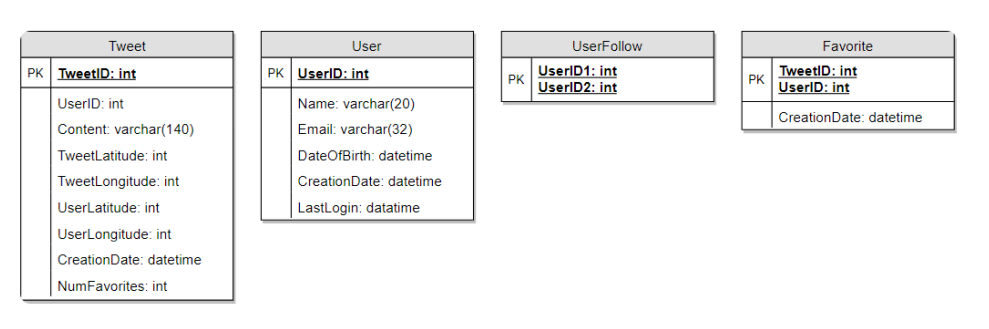
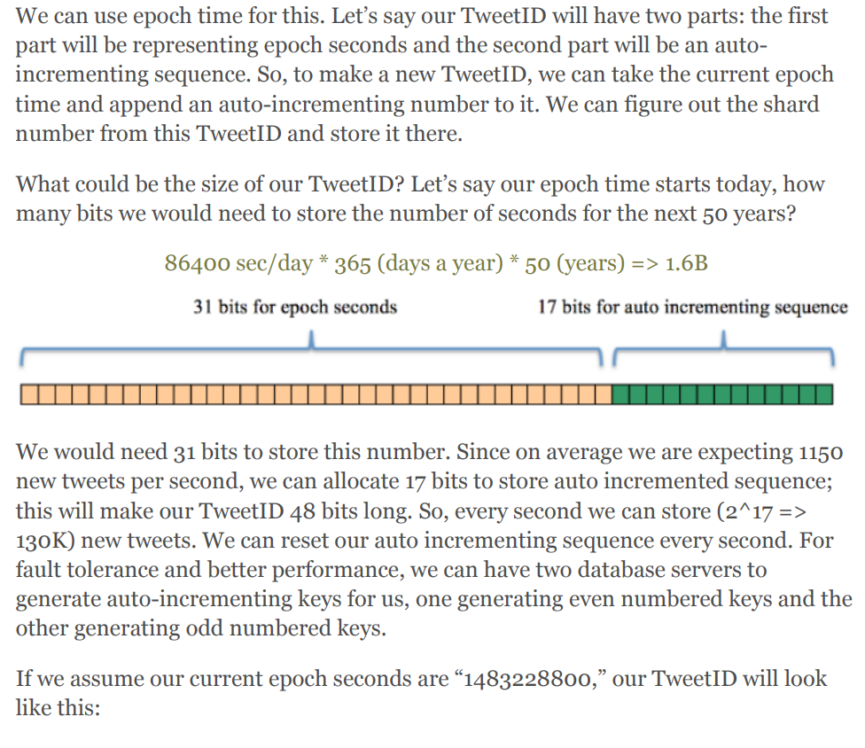
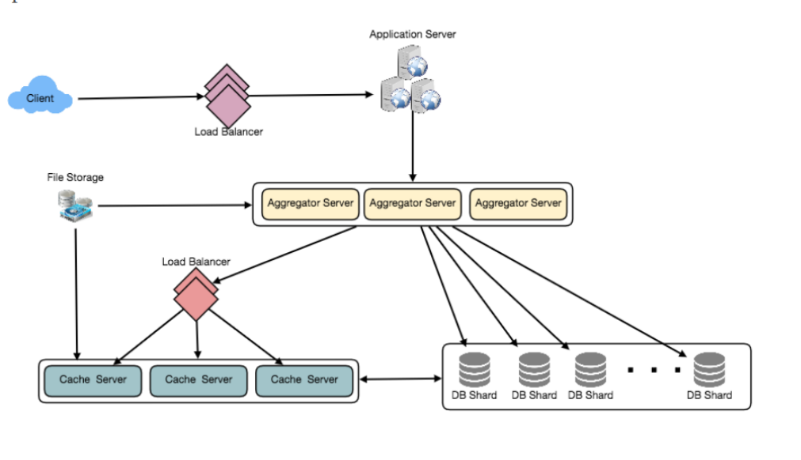

## Designing Twitter
- #### Functional Requirements
  - Users should be able to post new tweets.
  - A user should be able to follow other users.
  - Users should be able to mark tweets as favorites.
  - The service should be able to create and display a user’s timeline consisting of top tweets from all the people the user follows.
    - **Post, Follow, Like**
    - Tweets can contain photos and videos.
- #### Non-functional Requirements
  - Our service needs to be highly available
  - Acceptable latency of the system is 200ms for timeline generation.
  - Consistency can take a hit; if a user doesn’t see a tweet for a while, it should be fine.
- #### Extended Requirements
  - Searching for tweets.
  - Replying to a tweet.
  - Trending topics – current hot topics/searches.
  - Tagging other users
  - Tweet Notification.
  - Who to follow? Suggestions?
  - Moments
- #### Capacity Estimation and Constraints
  - 200 million daily active users
  - 100 million new tweets every day and on average each user follows 200 people
  - How many favorites per day? 200M users * 5 favorites => 1B favorites
  - How many total tweet-views will our system generate? a user visits their timeline two times a day and visits five other people’s pages. On each page if a user sees 20 tweets, 200M DAU * ((2 + 5) * 20 tweets) => 28B/day
  - Let’s say each tweet has 140 characters and we need two bytes to store a character without compression. Let’s assume we need 30 bytes to store metadata with each tweet, . Let’s assume we need 30 bytes to store metadata with each tweet. 100M * (280 + 30) bytes => 30GB/day
  - Not all tweets will have media, let’s assume that on average every fifth tweet has a photo and every tenth has a video. Let’s also assume on average a photo is 200KB and a video is 2MB. This will lead us to have 24TB of new media every day. (100M/5 photos * 200KB) + (100M/10 videos * 2MB) ~= 24TB/day
  - Bandwidth Estimates Since total ingress is 24TB per day, this would translate into 290MB/sec.
- #### Database Schema
  - 
- #### Data Sharding
  - Sharding based on UserID. 
    - What if a user becomes hot?
    -  Over time some users can end up storing a lot of tweets or having a lot of follows compared to others.
  -  Sharding based on TweetID.
  -  Sharding based on Tweet creation time
  -  What if we can combine sharding by TweedID and Tweet creation time?
     -  For this, we must make each TweetID universally unique in our system and each TweetID should contain a timestamp too.
     -  
     -  If we make our TweetID 64bits (8 bytes) long, we can easily store tweets for the next 100 years and also store them for mili-seconds granularity.
- #### Cache We can introduce a cache for database servers to cache hot tweets and users.
  - Which cache replacement policy would best fit our needs? LRU
  - How can we have a more intelligent cache?  80-20 rule 20%
  - What if we cache the latest data?  past three day? On a similar design, we can try caching photos and videos from the last three days
  - Our cache would be like a hash table where ‘key’ would be ‘OwnerID’ and ‘value’ would be a doubly linked list containing all the tweets from that user in the past three days. Since we want to retrieve the most recent data first, we can always insert new tweets at the head of the linked list, which means all the older tweets will be near the tail of the linked list. Therefore, we can remove tweets from the tail to make space for newer tweets.
  - 
- #### Load Balancing
  - 1) Between Clients and Application servers
  - 2) Between Application servers and database replication servers
  - 3) Between Aggregation servers and Cache server.
  - Initially, a simple Round Robin approach can be adopted
  - A problem with Round Robin LB is that it won’t take servers load into consideration. If a server is overloaded or slow, the LB will not stop sending new requests to that server.
  - a more intelligent LB solution can be placed that periodically queries backend server about their load and adjusts traffic based on that
- #### Monitoring
  - New tweets per day/second, what is the daily peak?
  - Timeline delivery stats, how many tweets per day/second our service is delivering
  - Average latency that is seen by the user to refresh timeline
-  #### Extended Requirements
   -  How do we serve feeds?
   -  Retweet
   -  Trending Topics
   -  Who to follow? How to give suggestions?
   -  Moments
   -  Search