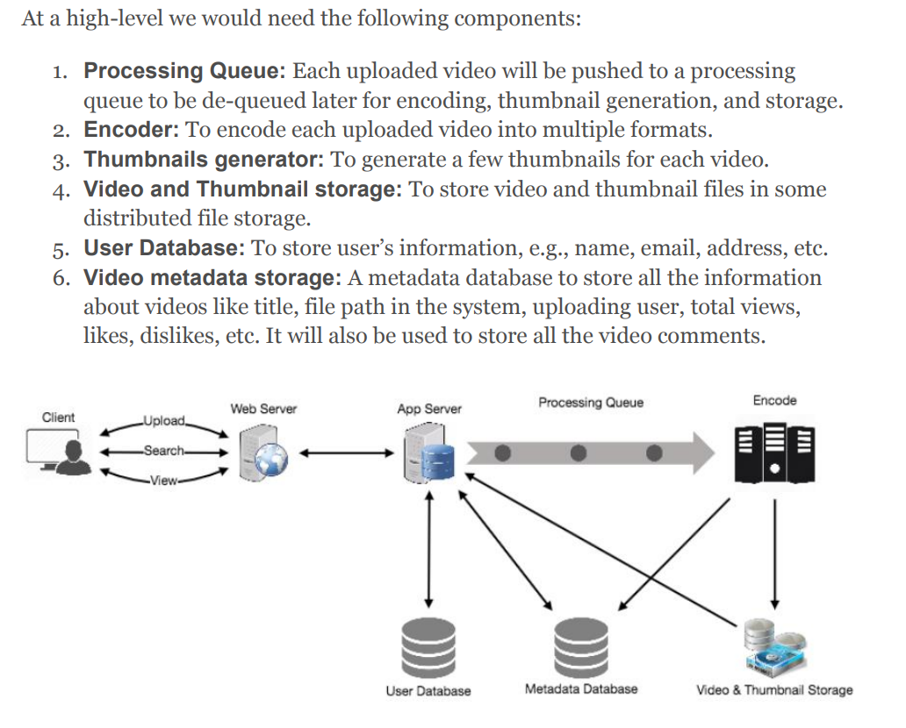
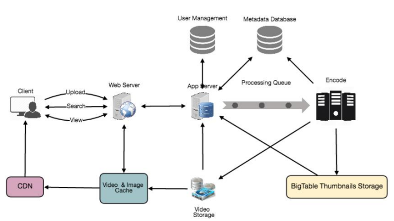

## Designing Youtube or Netflix
- #### Requirements and Goals of the System
  - Users should be able to upload videos.
  - Users should be able to share and view videos.
  - Users should be able to perform searches based on video titles.
  - Our services should be able to record stats of videos, e.g., likes/dislikes, total number of views, etc.
  - Users should be able to add and view comments on videos
- #### Non-Functional Requirements
  - highly reliable
  - highly available
  - Users should have a real time experience while watching videos and should not feel any lag
- #### Capacity Estimation
  - assume we have 1.5 billion total users, 800 million of whom are daily active users
  - on average, a user views five videos per day then the total video-views per second would be 800M * 5 / 86400 sec => 46K videos/sec
  - assume our upload:view ratio is 1:200 -》 46K / 200 => 230 videos/sec
  - assume that every minute 500 hours worth of videos are uploaded to Youtube. If on average, one minute of video needs 50MB of storage 500 hours * 60 min * 50MB => 1500 GB/min **(25 GB/sec)**
  - With 500 hours of video uploads per minute and assuming each video upload takes a bandwidth of 10MB/min, we would be getting 300GB of uploads every minute -》 500 hours * 60 mins * 10MB => 300GB/min (5GB/sec)
  - Assuming an upload:view ratio of 1:200, we would need 1TB/s outgoing bandwidth.
- #### System APIs
  - upload; Search; Stream
- High Level Design
  - 
- #### Database Schema
  - Video metadata storage - MySql
    - VideoID
    - Title
  - User data storage - MySql
    - UserID, Name, email, address, age, registration details etc.
- #### Detailed Component Design
  - segregate our read traffic from write traffic
  - writes will go to master first and then gets applied at all the slaves
  - some staleness is OK
  - Where would thumbnails be stored? assume that every video will have five thumbnails
    - Thumbnails are small files with, say, a maximum 5KB each
    - Read traffic for thumbnails will be huge compared to videos
      - Bigtable can be a reasonable choice here as it combines multiple files into one block to store on the disk and is very efficient in reading a small amount of data.
      - NOSQL DB
  - Video Uploads: Since videos could be huge, if while uploading the connection drops we should support resuming from the same point.
  - Video Encoding: Newly uploaded videos are stored on the server and a new task is added to the processing queue to encode the video into multiple formats.
  - 
- #### Metadata Sharding
  - Sharding based on UserID
    - What if a user becomes popular?
    - Over time, some users can end up storing a lot of videos compared to others. 
      - popular; too much for one; search by title need to reach all
  - Sharding based on VideoID:
    - This approach solves our problem of popular users but shifts it to popular videos.
    - We can further improve our performance by introducing a cache to store hot videos in front of the database servers
- #### Video Deduplication
  - Inline deduplication
- #### Load Balancing
  - We should use Consistent Hashing among our cache servers
-  #### Cache
   -  We can introduce a cache for metadata servers to cache hot database rows. Using Memcache to cache the data and Application servers before hitting database can quickly check if the cache has the desired rows. Least Recently Used (LRU) can be a reasonable cache eviction policy for our system
-  #### Content Delivery Network
   -  Our service can move popular videos to CDNs